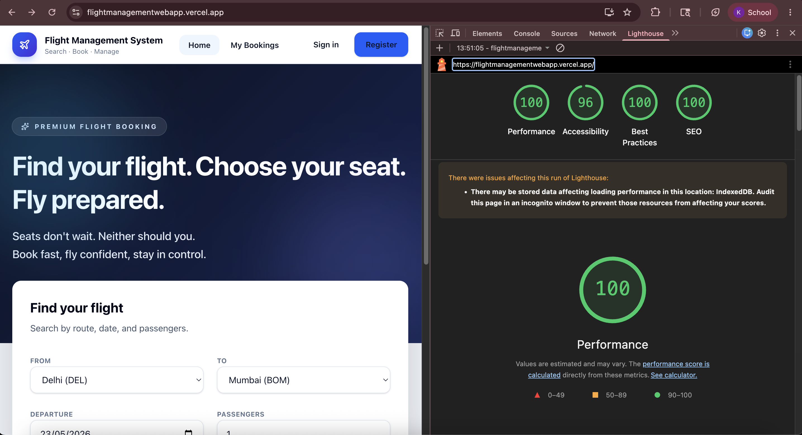
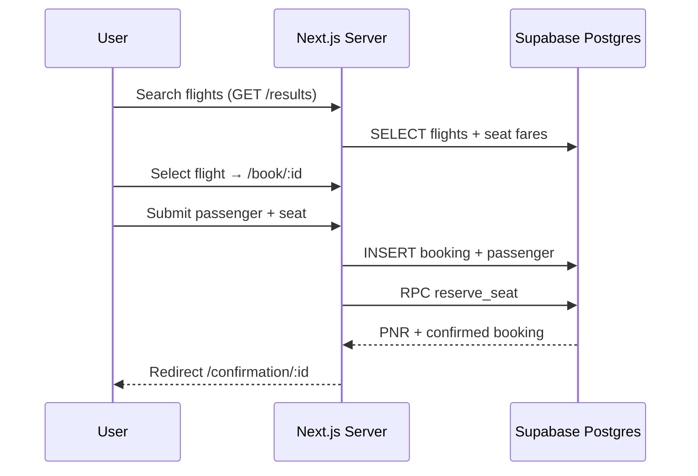

# Flight Management System

A responsive flight booking web application where passengers search scheduled flights, reserve seats on a live cabin map, manage itineraries, and install the experience as a Progressive Web App. The frontend is a Next.js App Router application; persistence, authentication, row-level security, and atomic booking operations live in Supabase (PostgreSQL).

---

## Live demo

| Environment | URL |
|-------------|-----|
| Production (Vercel) | [https://flightmanagementwebapp.vercel.app/](https://flightmanagementwebapp.vercel.app/) |
| Local development | [http://localhost:3000](http://localhost:3000) |

---

## What this application does

Passengers can:

- Search flights by origin, destination, travel date, and passenger count across seeded Indian domestic routes (DEL, BOM, BLR, HYD).
- Compare departures with per-cabin starting fares (economy, business, first).
- Sign in or register with Supabase Auth, then complete a booking with passenger details and interactive seat selection.
- Receive a unique **PNR** confirmation after a concurrency-safe seat lock in the database.
- View **My Bookings** with status badges (`confirmed`, `rescheduled`, `cancelled`).
- **Reschedule** to another flight on the **same route** (seat swap + fare difference recorded).
- **Cancel** an active booking; the seat is freed atomically in one database transaction.
- Use the app **offline** for previously cached search results and booking history (PWA + local snapshot).
- **Install** the app on mobile home screens via the browser install prompt.

---

## Tech stack

| Layer | Choice | Version (approx.) |
|-------|--------|-------------------|
| Framework | Next.js (App Router) | 16.2.x |
| UI | React | 19.2.x |
| Language | TypeScript | 5.x |
| Styling | Tailwind CSS | 4.x |
| Database & Auth | Supabase (PostgreSQL, Auth, Realtime) | — |
| Client state | Zustand + `persist` middleware | 5.x |
| Validation | Zod | 4.x |
| Icons | lucide-react | — |
| PWA | `@ducanh2912/next-pwa` (maintained **next-pwa** fork, Workbox) | 10.x |


## Repository layout

```text
flight_management_web_app/
├── public/
│   ├── icons/                 # PWA icons (192×192, 512×512)
│   └── screenshots/lighthouse-pwa.png
├── src/
│   ├── app/                   # App Router pages & server actions
│   │   ├── page.tsx           # Home + flight search
│   │   ├── results/           # Search results (Server Component + Supabase)
│   │   ├── book/[flightId]/   # Passenger form + cabin seat map
│   │   ├── confirmation/      # PNR confirmation
│   │   ├── bookings/          # My Bookings (reschedule / cancel)
│   │   ├── login|register/    # Auth screens
│   │   ├── offline/           # PWA offline fallback
│   │   └── manifest.ts        # Web app manifest
│   ├── components/            # UI modules (flights, booking, bookings, pwa)
│   ├── lib/                   # Supabase clients, flight queries, validations
│   ├── store/                 # Zustand stores
│   └── types/                 # Shared TypeScript domain types
├── supabase/
│   ├── migrations/            # SQL schema, RLS, RPCs (versioned)
│   └── seed/                  # Demo flights + seat maps
├── middleware.ts              # Supabase session refresh + route guards
└── next.config.ts             # PWA / Workbox runtime caching
```

---

## Application routes

| Route | Access | Description |
|-------|--------|-------------|
| `/` | Public | Flight search (hero + search form) |
| `/results` | Public | Matching flights for query string |
| `/login`, `/register` | Public | Email/password auth |
| `/book/[flightId]` | Authenticated | Passenger details + cabin seat map |
| `/confirmation/[bookingId]` | Authenticated | PNR and itinerary summary |
| `/bookings` | Authenticated | List, reschedule, cancel |
| `/offline` | Public | Shown when navigation fails offline (PWA fallback) |

Protected prefixes are enforced in `middleware.ts` and again in server pages via `requireUser()`.

---

## Local setup

### Prerequisites

- Node.js 20+
- npm 10+
- A Supabase project (free tier is sufficient)

### 1. Clone and install

```bash
git clone https://github.com/pseudo-nikhilk18/flight_management_webapp
cd flight_management_web_app
npm install
```

### 2. Environment variables

Copy the example file and fill in values from **Supabase → Project Settings → API**:

```bash
cp .env.example .env.local
```

| Variable | Required | Description |
|----------|----------|-------------|
| `NEXT_PUBLIC_SITE_URL` | Yes | App URL (`http://localhost:3000` locally) |
| `NEXT_PUBLIC_SUPABASE_URL` | Yes | Project URL |
| `NEXT_PUBLIC_SUPABASE_ANON_KEY` | Yes | Publishable (anon) key — safe in browser |
| `SUPABASE_SERVICE_ROLE_KEY` | Optional locally | Secret key — **server only**, never expose to client |

### 3. Database migrations

In the Supabase **SQL Editor**, run in order:

1. `supabase/migrations/001_initial_schema.sql` — tables, RLS, `reserve_seat`, `cancel_booking`, Realtime on `seats`
2. `supabase/migrations/002_reschedule_booking.sql` — `reschedule_booking` RPC
3. `supabase/seed/seed.sql` — 8 flights, 4 routes, 124 seats per aircraft

See [`supabase/README.md`](./supabase/README.md) for verification queries.

### 4. Demo auth user

**Authentication → Users → Add user**

| Field | Value |
|-------|-------|
| Email | `passenger@flightdemo.test` |
| Password | `passenger123` |

Enable **Auto Confirm User** so email verification is not required during review.

### 5. PWA icons (optional locally)

```bash
npm run generate:icons
```

### 6. Run

```bash
npm run dev -- --webpack
```

Open [http://localhost:3000](http://localhost:3000). Next.js 16 defaults to Turbopack for `next dev`, which conflicts with the PWA webpack plugin—use `--webpack` as shown. PWA service worker is **disabled in development**; test install/offline with a production build:

```bash
npm run build && npm run start
```

### Scripts

| Command | Purpose |
|---------|---------|
| `npm run dev -- --webpack` | Development server |
| `npm run build` | Production build with webpack (PWA plugin; generates service worker) |
| `npm run start` | Serve production build |
| `npm run lint` | ESLint |
| `npm run generate:icons` | Regenerate `public/icons/*.png` |

---

## Database design

### Tables

**`flights`** — scheduled departures  
`id`, `flight_no`, `origin`, `destination`, `departs_at`, `arrives_at`, `aircraft_type`, `status` (`scheduled` | `delayed` | `cancelled`), `base_price`

**`seats`** — cabin inventory per flight  
`id`, `flight_id`, `seat_number`, `class` (`economy` | `business` | `first`), `is_available`, `extra_fee`

**`bookings`** — passenger reservations  
`id`, `user_id` → `auth.users`, `flight_id`, `seat_id`, `status` (`confirmed` | `rescheduled` | `cancelled`), `booked_at`, `total_price`, `pnr_code` (unique, auto-generated)

**`passengers`** — traveller details per booking  
`id`, `booking_id`, `full_name`, `passport_no`, `nationality`, `dob`

**`reschedules`** — audit trail when itinerary changes  
`id`, `booking_id`, `old_flight_id`, `new_flight_id`, `fee_charged`, `requested_at`

### Seed data

- **8 flights** across **4 routes**: DEL↔BOM, DEL↔BLR, BLR↔HYD (relative `now()` departure times).
- **124 seats per flight**: economy rows 1–18 (A–F), business 19–21 (A–D), first 22–23 (A–B).
- A few seats on `FM-101` are pre-marked unavailable for realistic UI demos.

---

## Security: Row Level Security (RLS)

RLS is enabled on all application tables.

| Table | Policy summary |
|-------|----------------|
| `flights` | `SELECT` for `anon` + `authenticated` (search before login) |
| `seats` | `SELECT` for `anon` + `authenticated` (seat map reads) |
| `bookings` | `SELECT` / `INSERT` / `UPDATE` only where `user_id = auth.uid()` |
| `passengers` | Access only when linked booking belongs to caller |
| `reschedules` | `SELECT` / `INSERT` only for own bookings |

**Important:** clients cannot assign seats or cancel by direct `UPDATE`. Database triggers require:

- `reserve_seat(booking_id, seat_id)` for seat assignment
- `cancel_booking(booking_id)` for cancellation

This prevents bypassing business rules from the browser even with the anon key.

---

## Database RPCs (atomic operations)

### `reserve_seat(p_seat_id, p_booking_id)`

- Locks booking and seat rows (`FOR UPDATE`).
- Verifies ownership, booking status, seat availability, and same-flight constraint.
- Sets `seats.is_available = false` and links `bookings.seat_id`.
- Designed to prevent double-booking under concurrent requests.

### `cancel_booking(p_booking_id)`

- Rejects cancellation within **2 hours of departure** (uses `flights.departs_at`).
- Frees the seat and sets `bookings.status = 'cancelled'` in one transaction.
- Enforced at database level, not only in UI.

### `reschedule_booking(p_booking_id, p_new_flight_id, p_new_seat_id)`

- Requires **same `origin` and `destination`** as the original flight.
- Swaps seats: releases old seat, locks new seat.
- Updates `bookings.flight_id`, `seat_id`, `total_price`, `status = 'rescheduled'`.
- Inserts `reschedules` with `fee_charged = max(0, new_total - old_total)`.
- Same 2-hour departure guard as cancellation.

### PNR generation

`BEFORE INSERT` trigger on `bookings` assigns a unique 6-character alphanumeric `pnr_code` when not provided.

---

## Supabase Realtime

The `seats` table is added to the `supabase_realtime` publication. The cabin seat map subscribes to `UPDATE` events so when another user books a seat, availability refreshes without reloading the page.

---

## Zustand state architecture

Two stores live under `src/store/`.

### `useFlightStore` (`use-flight-store.ts`)

Persists to `localStorage` key `flight-management-flight-store`.

| State field | Purpose |
|-------------|---------|
| `searchQuery` | Last origin, destination, date, passengers |
| `selectedFlight` | Flight chosen from results |
| `selectedSeat` | Seat chosen on cabin map |
| `bookingStep` | `search` → `results` → `passenger` → `seat` → `confirm` |
| `passengerForm` | In-progress traveller fields |
| `optimisticSeatSelection` | UI marks seat selected before server RPC completes |

**`partialize` (security):** persisted snapshot includes `searchQuery`, `selectedFlight`, `selectedSeat`, `bookingStep`, `passengers`, and passenger `fullName` / `nationality` / `dob` — **`passportNo` is never written to localStorage**. After rehydration, passport is always blank and must be re-entered.

**Reset behaviour:**

- `resetBookingProgress()` — after successful confirmation or booking cancellation
- `reset()` — on sign out (clears entire flight store)

### `useUserStore` (`use-user-store.ts`)

Persists to `localStorage` key `flight-management-user-store`.

| State field | Persisted? | Purpose |
|-------------|------------|---------|
| `sessionToken` | Yes | Supabase access token snapshot |
| `userEmail` | Yes | Display in header when offline |
| `cachedBookings` | Yes | Offline My Bookings fallback |

`StoreBootstrap` (in root layout) syncs session from Supabase Auth and refreshes cached bookings after login. Sign out clears both stores.

---

## Progressive Web App (PWA)

Implemented with **`@ducanh2912/next-pwa`** (actively maintained successor to `next-pwa`), configured in `next.config.ts`.

### Manifest (`src/app/manifest.ts`)

- **Name:** Flight Management System  
- **Display:** `standalone`  
- **Theme colour:** `#2563eb`  
- **Icons:** `public/icons/icon-192.png`, `public/icons/icon-512.png`

### Runtime caching (Workbox)

| Strategy | Targets |
|----------|---------|
| **StaleWhileRevalidate** | `/results` pages, Supabase REST `flights` and `bookings` |
| **CacheFirst** | `/_next/static/*`, images and static media |

### Offline behaviour

- **Document fallback:** `/offline` when a navigation request fails without network.
- **My Bookings:** last cached booking list from Zustand + Workbox API cache; offline banner explains cached data.
- Service worker is **off in `npm run dev`**; use production build to validate install/offline.

### Install prompt

`InstallPrompt` listens for `beforeinstallprompt` and shows a bottom banner on first visit for mobile viewports.

### Lighthouse

Progressive Web App audit on [https://flightmanagementwebapp.vercel.app/](https://flightmanagementwebapp.vercel.app/):



**Screenshot path:** `public/screenshots/lighthouse-pwa.png`

---

## Booking flow (end-to-end)



1. Search writes query to Zustand and navigates with URL params (shareable links).
2. Server Component loads flights matching route + departure date window.
3. Authenticated book page renders cabin map; seat click is optimistic in UI then persisted via `reserve_seat` on submit.
4. Confirmation page reads booking joined with flight, seat, and passenger.

---

## Reschedule and cancel (UI + DB)

- **Cancel:** confirmation dialog → `cancel_booking` RPC → page refresh.
- **Reschedule:** inline panel loads alternative flights (same route) → pick seat → confirmation dialog → `reschedule_booking` RPC.
- UI hides actions when departure is within 2 hours; database rejects even if API is called directly.

---


## Implementation summary

| Requirement | Implementation |
|-------------|----------------|
| Schema & RLS | Versioned SQL; owner-scoped bookings; public flight/seat read |
| Seat-lock RPC | `reserve_seat` with row locks |
| 2-hour cancel rule | `cancel_booking` + `departure_within_two_hours()` |
| Seat map + Realtime | Cabin grid by class; `seats` Realtime subscription |
| Reschedule + fee | `reschedule_booking` + `reschedules` table |
| Zustand persist | Two stores; `partialize` excludes passport |
| Responsive UI | Mobile nav, touch-friendly seat map, consistent spacing |
| PWA | Manifest, SW, offline page, install prompt, caching strategies |
| TypeScript | Strict mode; no `any` in application code |
| Commit history | Feature-focused commits per milestone |

---

## Design trade-offs

This section documents deliberate limits and what would change with more time—per the assignment brief on honest communication.

| Area | Current choice | If extended |
|------|----------------|-------------|
| **Bundlers (dev)** | `npm run dev -- --webpack` because the PWA plugin hooks webpack; Next.js 16 defaults to Turbopack | Adopt a Turbopack-native PWA path, or disable PWA wrapping in dev so `next dev` works without flags |
| **Offline / PWA** | Cached results pages and a My Bookings snapshot; service worker off in dev | True offline booking would need queued writes and conflict resolution—not attempted; seat locks must stay server-authoritative |
| **Business rules** | Enforced in Postgres RPCs + RLS, not only the UI | Keeps correctness under concurrent booking; trade-off is more SQL to maintain vs. trusting client-only checks |
| **Passenger persist** | Passport excluded from `localStorage` via Zustand `partialize` | Safer for shared devices; trade-off is re-entry after refresh mid-booking |
| **Passenger count** | Search supports 1–6 passengers; each booking stores one passenger row | Multi-passenger single itinerary would need schema/UI for multiple `passengers` per `booking_id` |
| **Demo data** | Seed flights use relative `now()` dates | Empty search results outside that window unless seed is re-run or dates are updated |
| **Payments** | Fares stored on booking; no payment gateway | Matches assignment scope; production would add PCI-compliant checkout |
| **Automated tests** | Manual + production Lighthouse; no Playwright/Cypress suite | E2E against Supabase test project would cover login → book → cancel paths regressions |

---

## Troubleshooting

| Issue | Likely fix |
|-------|------------|
| No flights in search | Use departure date 2–6 days ahead (seed uses relative dates) |
| `reserve_seat` fails | Seat taken concurrently; pick another seat |
| Cancel blocked | Within 2 hours of `departs_at` by design |
| `npm run dev` fails (Turbopack/webpack) | Use `npm run dev -- --webpack` |
| PWA not installing locally | Run `npm run build && npm run start`, not `dev` |
| Realtime not updating | Confirm `seats` in Supabase → Database → Replication |

---


